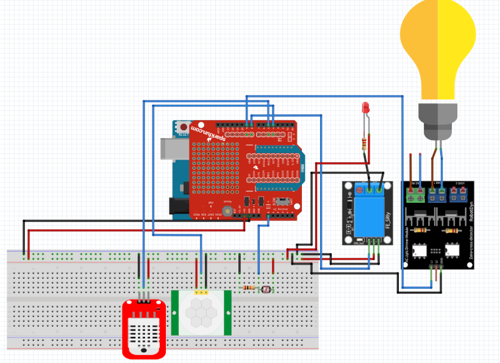

# Mini-projet Présence 2022

- [Mini-projet Présence 2022](#mini-projet-présence-2022)
  - [Présentation](#présentation)
  - [Objectifs](#objectifs)
  - [Captures d'écran](#captures-décran)
  - [Auteur](#auteur)

## Présentation

Il s’agit de déployer un objet connecté permettant d’afficher à distance l’état d’une salle. La
présence et les conditions de la salle seront affichées en temps réel.

## Objectifs

Le système numérique interagit avec une application logiciel web réalisée par un ou plusieurs étudiants IR.

Les fonctionnalités demandées sont :

- Communiquer via une liaison série avec une application logiciel web
- Envoyer des données mise en forme à partir des données issues des différents capteurs
- Récupérer des commandes et/ou paramètres de configuration pour le  module électronique
- Mettre en œuvre les différents capteurs
- Mettre en œuvre les différents actionneurs
- Élaborer le code source nécessaire au fonctionnement du module sous PlatformIO
- Mettre en forme les données
- Valider le choix des capteurs en fonction du cahier des charges
- produire une IHM web afin :
    - d'afficher des données en provenance du module électronique
    - de commander et/ou paramétrer le module électronique
    - stocker des données et/ou des paramètres de configuration dans une base de données

## Captures d'écran

## Auteur

- [Mathieu Moyaerts](https://github.com/mmoyaerts)
- [Samuel Libes](https://github.com/slibes)
